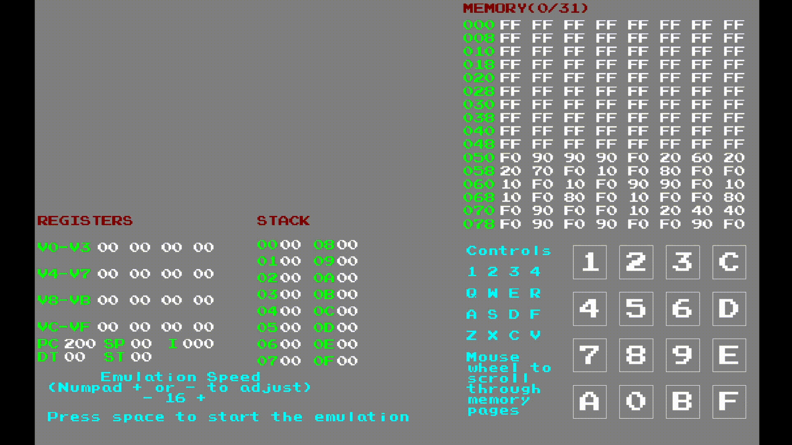

# Licensing
This project is licensed under the MIT license. See the [license](LICENSE.txt) file.

# What is this?
This is an emulator that emulates the simple Chip-8 system, which was developed in 1970s. The project uses [olcPixelGameEngine](https://github.com/OneLoneCoder/olcPixelGameEngine) for rendering, [olcSoundWaveEngine](https://github.com/OneLoneCoder/olcSoundWaveEngine) for sounds on the emulator side and Avalonia UI with .NET8 on the launcher side. The ROMs included in the project were taken from [here](https://github.com/kripod/chip8-roms).

The following is a screenshot of the launcher. It is configured so that you can only choose a single ROM, trying to choose another one deselects the currently selected ROM. The ROMs in the "Hires" category doesn't work at all, since they require extra features that exist on extended versions of Chip-8 and the emulator doesn't currently support them.


Finally, the following is a demo of the emulator running the Pong (1 player) ROM, which can be found under the Games category.



# Building on Windows
On Windows, project files of Visual Studio should contain all the necessary information to build and run the emulator. You need to install the following from Visual Studio Installer:
  1) C#/.NET desktop development package (make sure the .NET version is .NET8, higher versions caused problems in my testing)
  2) C++ desktop development package

You might need to set Chip8EmulatorLauncher project as the startup project in Visual Studio. Once you do all of these, you can simply press the Start button.

Note: Visual Studio 2024 was used in the development of this project. Higher versions require legacy packages to be installed.

# Building on Linux (Ubuntu)
On Ubuntu, you first need to install the necessary libraries.

```
sudo apt install make cmake libgl-dev libpng-dev libpulse-dev dotnet8
```

Once you install these, you can go to the directory you cloned the project into to build the project.
The project internally uses CMake, but in order to simplify the build commands I added a Makefile layer on top of CMake. Once you are in the project's directory, run:

```
make init
```

This will create the build folder for CMake. You only need to do this once unless you change CMakeLists.txt.

After the build system is initialized, you can simply run:

```
make
```

This will build the emulator first, then the launcher. Finally, it will start the launcher. From there, you can choose a ROM and start the emulator.

If you just want to build the emulator (and not the launcher), you can run the following command after initializing the build system:

```
make build_emulator
```

Similarly, if you just want to build the launcher (and not run it as well as not build the emulator), you can run the following command after initializing the build system:

```
make build_launcher
```

And finally, to clean everything you can run:

```
make clean
```
