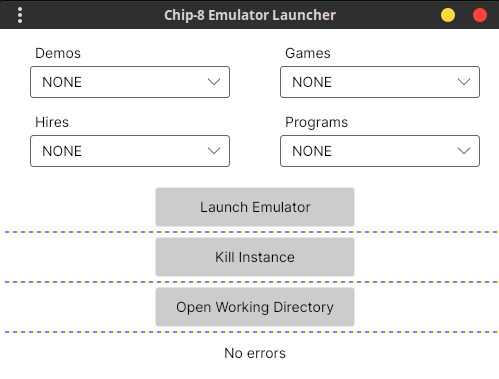
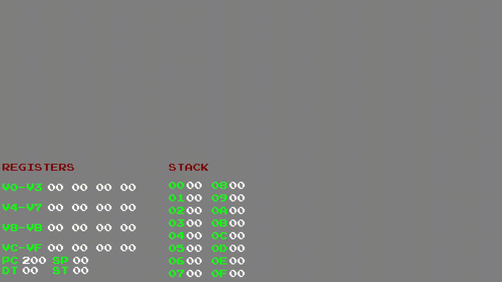

# Licensing
This project is licensed under the MIT license. See the [license](LICENSE.txt) file.

# Chip-8 Emulator
This is a project I started to learn more about emulation, something that I am curious about. I chose Chip-8 because it is a simple system, which I thought was appropriate for my first emulation project. I am using olcPixelGameEngine for rendering and olcSoundWaveEngine for sound, which have their respective GitHub repositories [here](https://github.com/OneLoneCoder/olcPixelGameEngine) and [here](https://github.com/OneLoneCoder/olcSoundWaveEngine).

I developed the emulator itself in C++. Once I found Chip-8 ROMs [here](https://github.com/kripod/chip8-roms) and added them to the project, it became apparent that I would need a launcher because of the amount of ROMs. That's when I decided to write a launcher in C#, which scans the folders, lists all the ROMs and runs the emulator with the selected ROM.

The following is a screenshot of the launcher. It is configured so that you can only choose a single ROM, trying to choose another one deselects the currently selected ROM. The ROMs in the "Hires" category doesn't work at all, since they require extra features that exist on extended versions of Chip-8 and the emulator doesn't currently support them.

Finally, the following is a demo of the emulator running the Bitmap Viewer ROM, which can be found under the Programs category.

